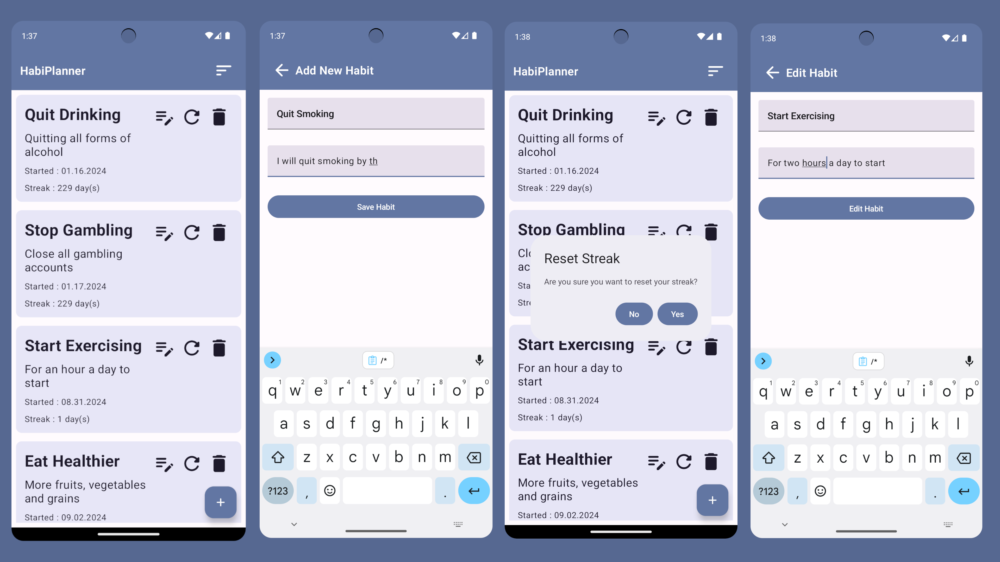

## HabiPlanner 📋

HabiPlanner is a self-management Android application that lets users keep track of the habits and positive changes they're bringing into their lives.

### Features

Creation and management of habits, automatically tracking habit streak and duration 
ROOM Local database, automatically saving habits when the application is closed
Editing existing habits as the users' goals change
Reset the streak timer when the user breaks their habit

### Technology

Software: Android Studio 
Language: Kotlin 
Tools: Jetpack Compose, Gradle, Room Local Database

